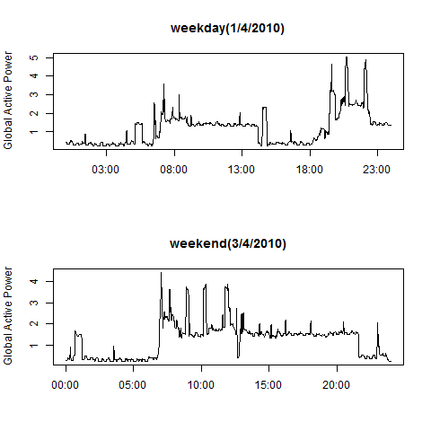
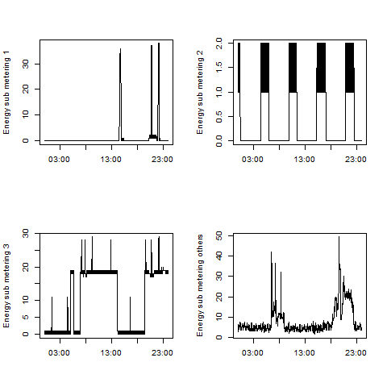

## Introduction

Here I use data "Individual household electric power consumption Data Set" from the <a href="http://archive.ics.uci.edu/ml/">UC Irvine Machine Learning Repository</a>. I'm trying to analyze the difference of household power consumption between weekday and weekend, and also get the main source for this whole electric power consumption. The main purpose of this project is to guide the electric company how to effectively supply electric energy for weekday and weekend. What's more, we know that The household energy usage has several different sources, such as the kitchen, the laundry room, the electric water-heater and an air-conditioner, and so on. After reviewing these parts, we can find out which part is the main source of the consumption, then people will get some idea about how to save some energy from the analysis.   

* <b>Dataset</b>: <a href="https://archive.ics.uci.edu/ml/machine-learning-databases/00235/household_power_consumption.zip">Electric power consumption</a> [20Mb]

* <b>Description</b>: Measurements of electric power consumption in
one household with a one-minute sampling rate over a period of almost
4 years. Different electrical quantities and some sub-metering values
are available.

The following descriptions of the 9 variables in the dataset are taken
from
the <a href="https://archive.ics.uci.edu/ml/datasets/Individual+household+electric+power+consumption">UCI
web site</a>:

<ol>
<li><b>Date</b>: Date in format dd/mm/yyyy </li>
<li><b>Time</b>: time in format hh:mm:ss </li>
<li><b>Global_active_power</b>: household global minute-averaged active power (in kilowatt) </li>
<li><b>Global_reactive_power</b>: household global minute-averaged reactive power (in kilowatt) </li>
<li><b>Voltage</b>: minute-averaged voltage (in volt) </li>
<li><b>Global_intensity</b>: household global minute-averaged current intensity (in ampere) </li>
<li><b>Sub_metering_1</b>: energy sub-metering No. 1 (in watt-hour of active energy). It corresponds to the kitchen, containing mainly a dishwasher, an oven and a microwave (hot plates are not electric but gas powered). </li>
<li><b>Sub_metering_2</b>: energy sub-metering No. 2 (in watt-hour of active energy). It corresponds to the laundry room, containing a washing-machine, a tumble-drier, a refrigerator and a light. </li>
<li><b>Sub_metering_3</b>: energy sub-metering No. 3 (in watt-hour of active energy). It corresponds to an electric water-heater and an air-conditioner.</li>
</ol>

## Plots

### Plot 1
The first plot here is simply to examine how household energy usage
varies over one day in April, 20010. Specifically, April 1st (which represents weekday) and April 3rd (which represents weekend) to be chosen to review the difference of the household energy usage between weekday and weekend. 

 

### Plot 2
The household energy usage can be divied into four parts: energy sub-metering No. 1, energy sub-metering No. 2, energy sub-metering No. 3, and others which can be obtained from this expression (global_active_power*1000/60 - sub_metering_1 - sub_metering_2 - sub_metering_3). The second plot is to try to find out the main source for the whole household energy consumption.
 

